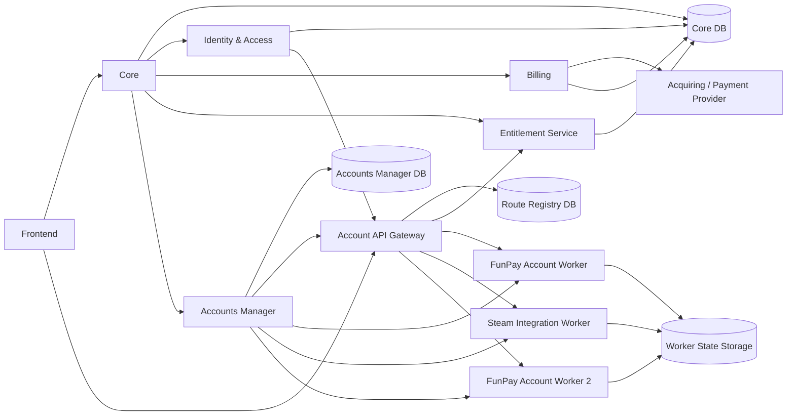
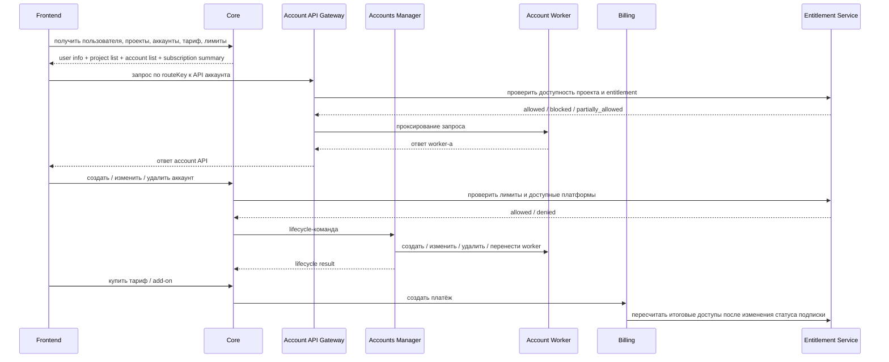

# DDCRM — общий черновик архитектуры v3

## Полное название
**DDCRM (Digital Deals CRM)**

## Формат продукта
SaaS-система для управления продажами цифровых товаров на нескольких площадках.

## Для кого система
- одиночный продавец
- команда продавца
- несколько участников в рамках одного проекта

## Базовая модель
В системе есть пользователи, проекты и подключённые аккаунты площадок.  
Один пользователь может состоять в нескольких проектах.  
В одном проекте может быть несколько аккаунтов одной и той же площадки.  
Каждый проект имеет **собственные тарифы, add-on, ограничения и доступы**.

## Ключевой коммерческий принцип
Настройки и доступы задаются **на уровне проекта**:
- какие площадки разрешены
- сколько аккаунтов каждой площадки можно подключать
- какие модули доступны
- активен ли тестовый период
- действует ли блокировка из-за неоплаты

## Главный архитектурный принцип
Система разделена на:
- **Core** — бизнес-ядро CRM
- **Identity & Access** — роли и доступы пользователей
- **Billing** — источник истины по платежам и подпискам
- **Entitlement Service** — источник истины по итоговым ограничениям и доступам проекта
- **Accounts Manager** — lifecycle аккаунт-воркеров
- **Account API Gateway** — единая точка доступа к API аккаунтов
- **Account Worker** — отдельный mini-backend одного аккаунта площадки
- **Core DB** — бизнес-данные и read-модели
- **Accounts Manager DB** — данные по серверам, подам и lifecycle
- **Route Registry DB** — отдельная БД маршрутизации `routeKey -> worker binding`
- **Worker State Storage** — внешнее хранилище runtime-состояния worker-ов

## Выбранная схема

## Слои ответственности

### Frontend
UI системы. Работает с Core и через Gateway вызывает API аккаунтов.

### Core
Хранит и обслуживает основные бизнес-сущности CRM:
- пользователи
- проекты
- аккаунты площадок
- общие статусы
- бизнес-представление тарифов и ограничений
- подготовку данных для UI

### Identity & Access
Отвечает за:
- проектные роли
- системных админов DDCRM
- membership пользователя в проекте
- проверку прав пользователя
- выдачу данных для проверки доступа в Gateway (через claims и membership cache)

### Billing
Отвечает за:
- тарифы
- add-on
- платежи
- подписки
- продления
- ручные и автоматические платёжные сценарии
- возвраты
- дедупликацию webhook и reconciliation

### Entitlement Service
Отвечает за:
- итоговые разрешения проекта
- доступные платформы
- лимиты по количеству площадок/аккаунтов
- блокировки и частичные ограничения при неоплате
- `trial/grace` по политике тарифа
- историю изменений ограничений

### Accounts Manager
Управляет жизненным циклом аккаунтов:
- создать worker
- изменить worker
- удалить worker
- перенести worker
- обновить конфиг
- балансировать размещение
- выполнять health-check
- инициировать upsert/remove маршрута через Gateway

### Account API Gateway
Отдельный микросервис для:
- проксирования запросов
- проверки токена и role/membership (claims + cache)
- проверки entitlement
- маршрутизации по `routeKey`
- ограничения доступа к account API

### Route Registry DB
Отдельная БД маршрутизации:
- `routeKey`
- `accountId`
- `projectId`
- `worker binding`
- версия маршрута

### Account Worker
Mini-backend одного аккаунта площадки.  
Все worker-ы обязаны иметь одинаковый API-контракт.

## Общая идея потока

## Ключевые ограничения и коммерческие правила
- тариф привязан к проекту
- у каждого проекта отдельный набор тарифов и add-on
- `trial/grace` задаются политикой конкретного тарифа
- тариф + отдельные add-on
- площадки могут входить в тариф и могут продаваться отдельно
- лимиты жёсткие (**hard limits**)
- при снижении тарифа или неоплате неразрешённые площадки блокируются, но не удаляются сразу
- Gateway перестаёт пускать в worker только для запрещённых entitlement-операций
- есть ручные платёжные сценарии
- есть ручной override со стороны системного админа DDCRM (с аудитом и сроком действия)
- для каждой площадки прокси обязателен

## Что специально не детализируется в этом черновике
- конкретные API-методы
- DTO
- таблицы БД
- детали оркестрации контейнеров
- детали токенов и сетевой реализации
- детали брокеров событий
