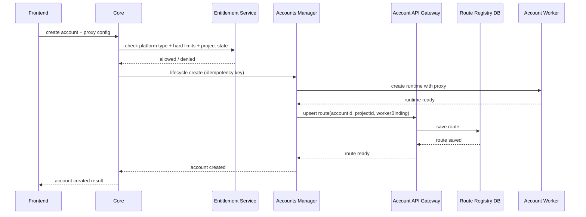
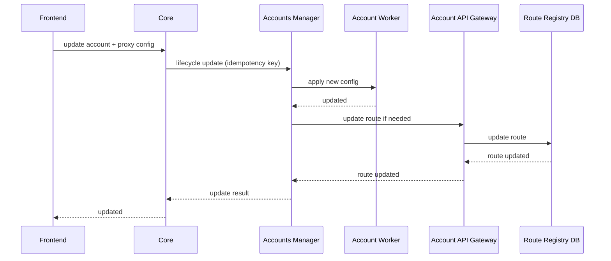
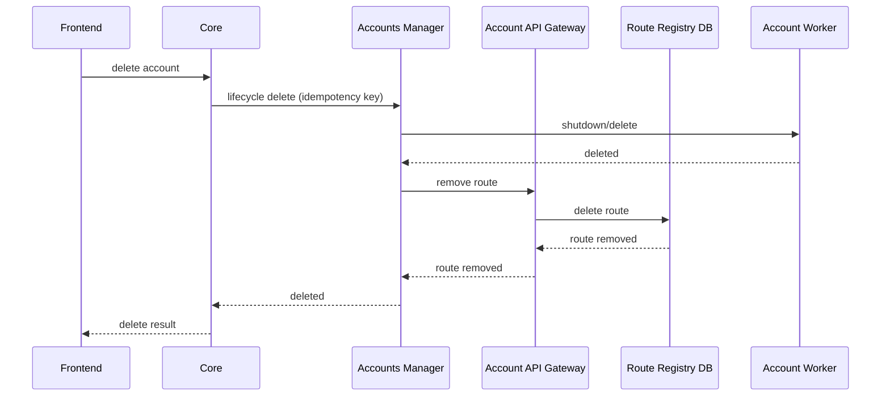
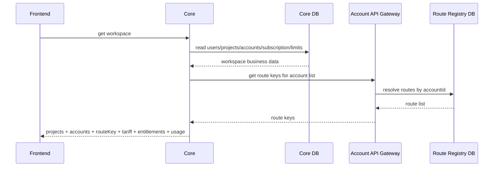
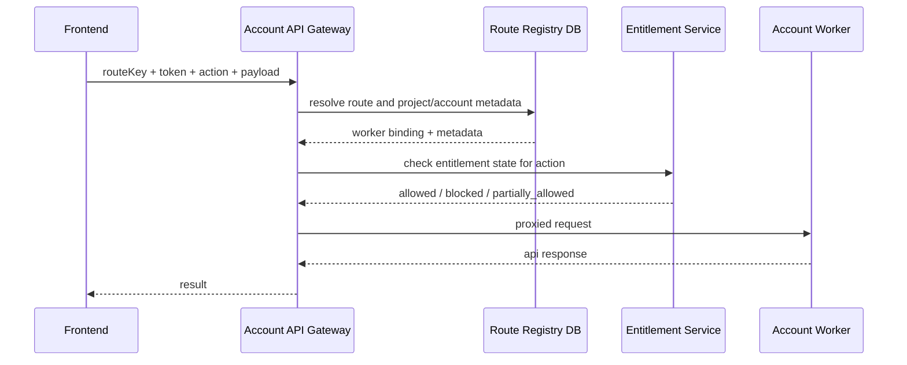
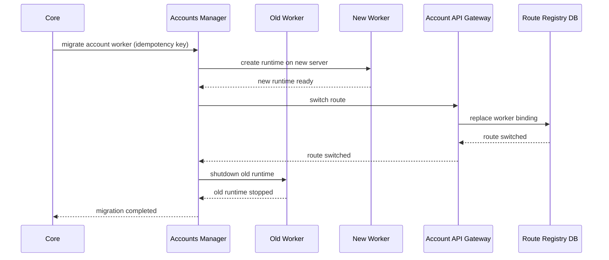
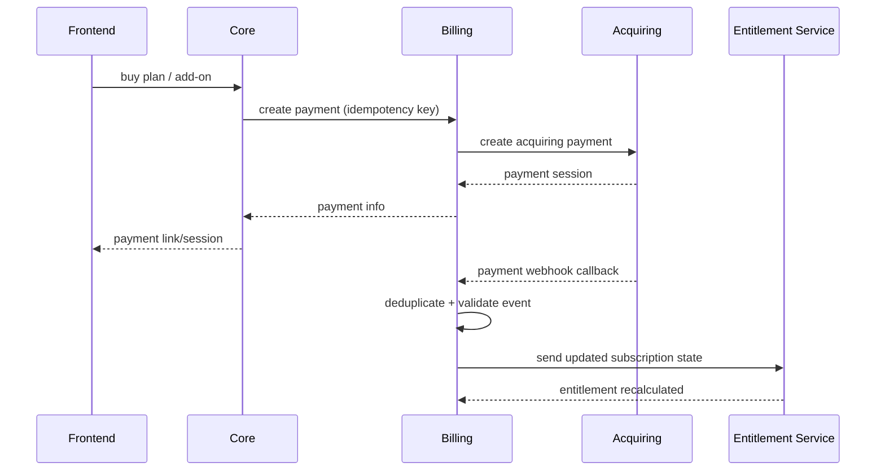
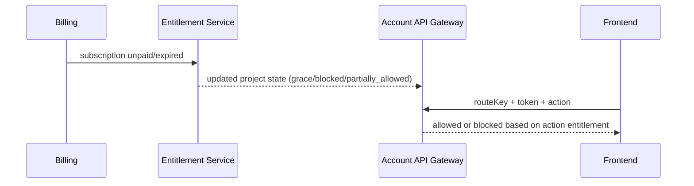

# Основные потоки данных

## 1. Создание аккаунта

## 2. Изменение аккаунта

## 3. Удаление аккаунта

## 4. Получение списка аккаунтов и лимитов

## 5. Вызов account API

## 6. Перенос worker-а

## 7. Оплата тарифа / add-on

## 8. Неоплата и ограничение доступа

## 9. Базовые error cases
- worker недоступен
- route устарел или отсутствует
- stale membership cache в Gateway
- proxy/auth проблема на стороне worker
- entitlement не позволяет подключить платформу
- превышен hard limit
- webhook дублируется

## 10. Технические гарантии
- mutating-операции выполняются с `idempotency key`
- webhook обрабатываются с дедупликацией
- route-операции версионируются
