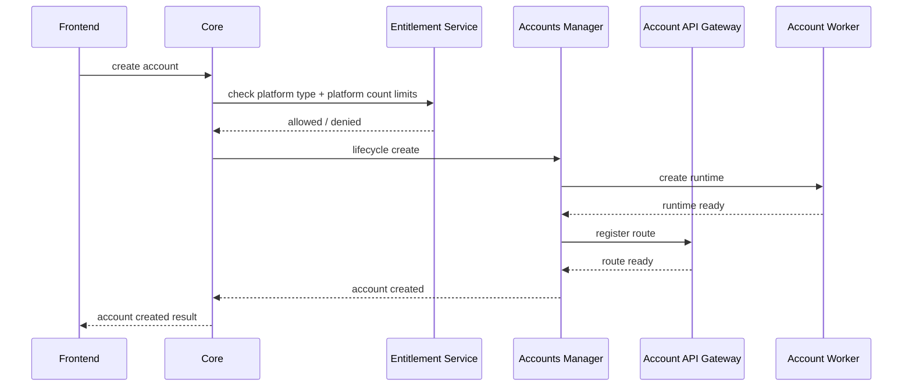
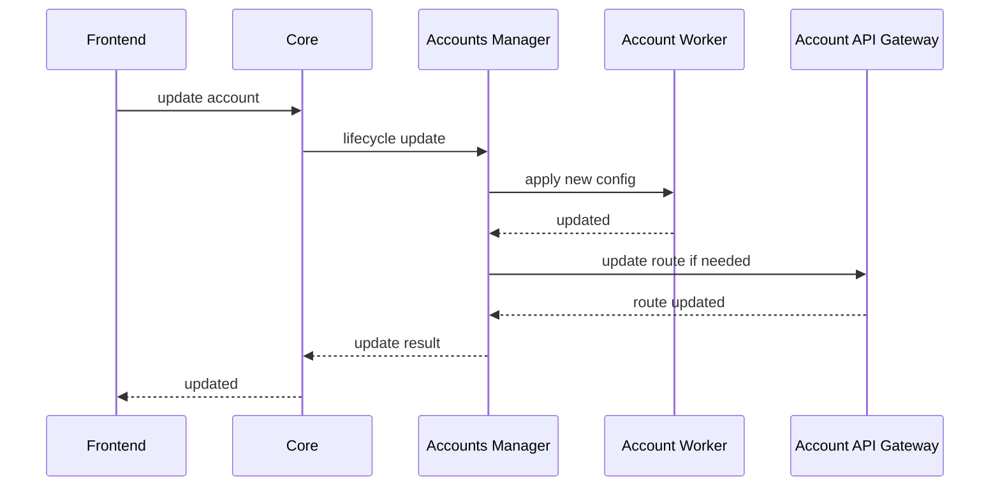
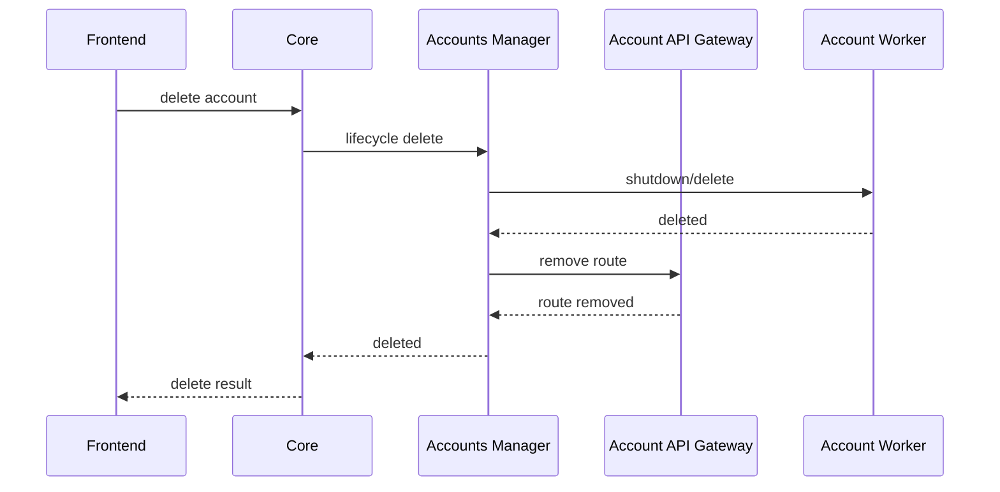
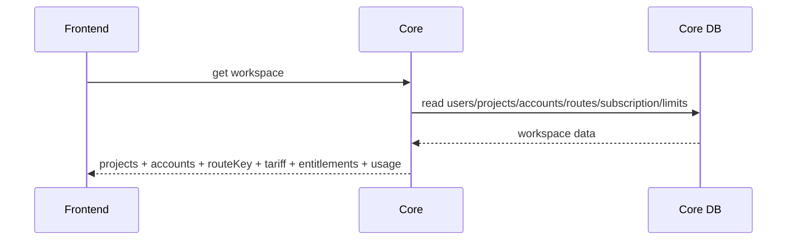
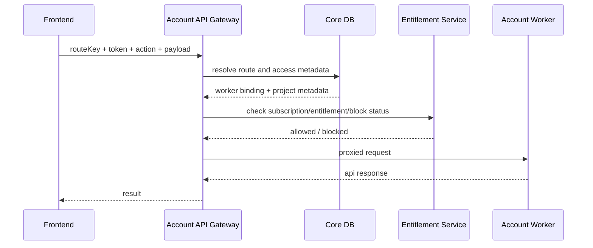
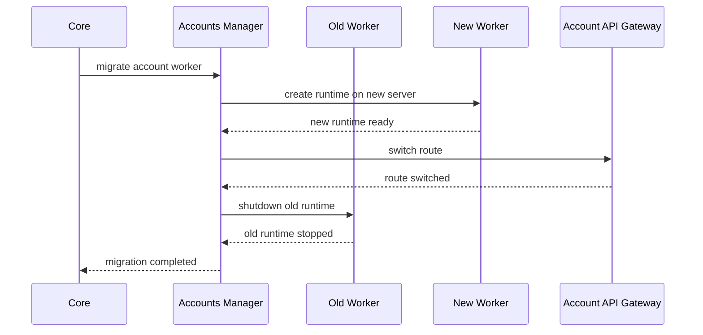
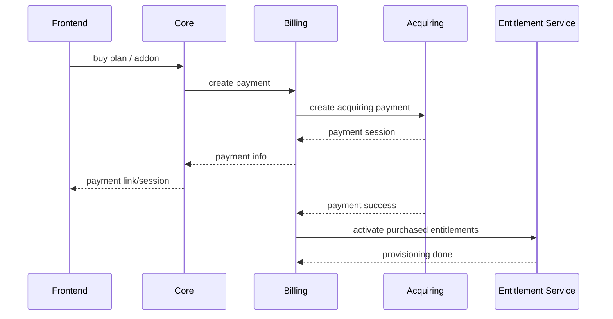
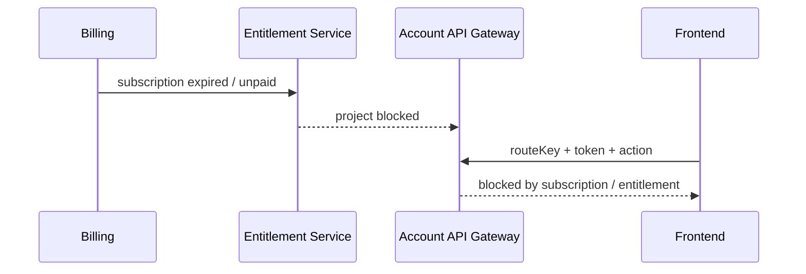

# Основные потоки данных

## 1. Создание аккаунта

## 2. Изменение аккаунта

## 3. Удаление аккаунта

## 4. Получение списка аккаунтов и лимитов

## 5. Вызов account API

## 6. Перенос worker-а

## 7. Оплата тарифа / add-on

## 8. Блокировка из-за неоплаты

## 9. Базовые error cases
- worker недоступен
- route устарел
- proxy / auth проблема на стороне worker
- entitlement не позволяет подключить платформу
- превышен hard limit
- проект заблокирован из-за неоплаты
