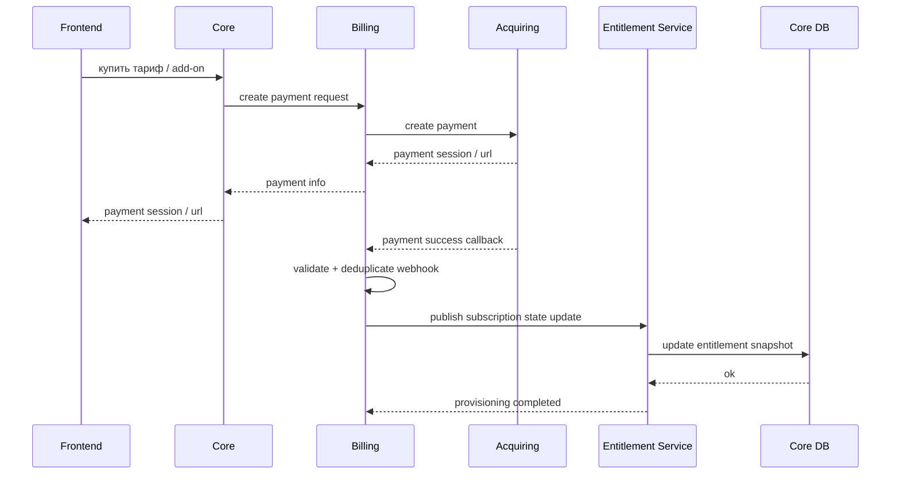

# Поток подписки и оплаты

## Основной поток

## Что должно включаться после оплаты
- тариф проекта
- add-on
- доступные платформы
- лимиты количества площадок / аккаунтов
- модули проекта
- trial / paid state
- блокировки и снятие блокировок

## State machine доступа
- состояние доступа ведёт Entitlement Service
- переходы `trial -> active -> grace -> blocked`
- длительности `trial/grace` задаются политикой тарифа

## Ручной сценарий
Архитектура должна поддерживать ручное подтверждение платежа и ручную активацию доступа вне эквайринга.

## Источник истины
- факт оплаты и состояние подписки: Billing
- итоговые разрешения проекта: Entitlement Service
