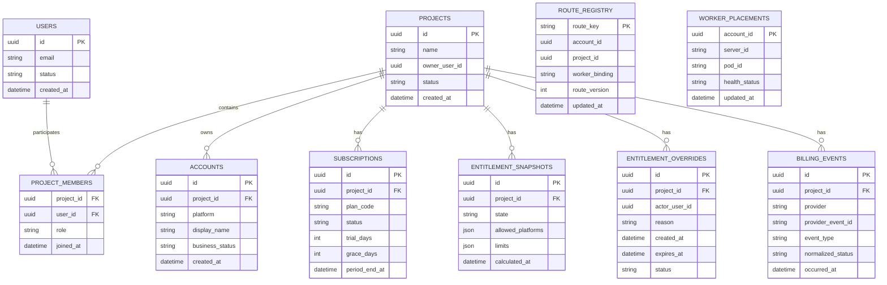

# DDCRM — ERD (черновик)

```mermaid
erDiagram
    USERS ||--o{ PROJECT_MEMBERS : participates
    PROJECTS ||--o{ PROJECT_MEMBERS : contains
    PROJECTS ||--o{ ACCOUNTS : owns
    PROJECTS ||--o{ SUBSCRIPTIONS : has
    PROJECTS ||--o{ ENTITLEMENT_SNAPSHOTS : has
    PROJECTS ||--o{ ENTITLEMENT_OVERRIDES : has
    PROJECTS ||--o{ BILLING_EVENTS : has

    USERS {
      uuid id PK
      string email
      string status
      datetime created_at
    }

    PROJECTS {
      uuid id PK
      string name
      uuid owner_user_id
      string status
      datetime created_at
    }

    PROJECT_MEMBERS {
      uuid project_id FK
      uuid user_id FK
      string role
      datetime joined_at
    }

    ACCOUNTS {
      uuid id PK
      uuid project_id FK
      string platform
      string display_name
      string business_status
      datetime created_at
    }

    SUBSCRIPTIONS {
      uuid id PK
      uuid project_id FK
      string plan_code
      string status
      int trial_days
      int grace_days
      datetime period_end_at
    }

    BILLING_EVENTS {
      uuid id PK
      uuid project_id FK
      string provider
      string provider_event_id
      string event_type
      string normalized_status
      datetime occurred_at
    }

    ENTITLEMENT_SNAPSHOTS {
      uuid id PK
      uuid project_id FK
      string state
      json allowed_platforms
      json limits
      datetime calculated_at
    }

    ENTITLEMENT_OVERRIDES {
      uuid id PK
      uuid project_id FK
      uuid actor_user_id
      string reason
      datetime created_at
      datetime expires_at
      string status
    }

    ROUTE_REGISTRY {
      string route_key PK
      uuid account_id
      uuid project_id
      string worker_binding
      int route_version
      datetime updated_at
    }

    WORKER_PLACEMENTS {
      uuid account_id PK
      string server_id
      string pod_id
      string health_status
      datetime updated_at
    }
```

## Примечания
- `ROUTE_REGISTRY` — отдельная БД маршрутизации.
- proxy credentials и session tokens не хранятся в Core DB; они находятся в Worker State Storage.
