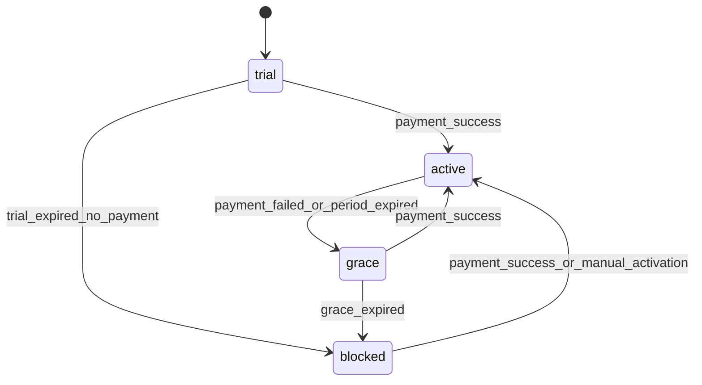

# Subscription and Entitlement State Machine

## Канонические состояния
- `trial`
- `active`
- `grace`
- `blocked`

## Правила переходов
- `trial -> active` при успешной оплате
- `trial -> blocked` при окончании trial без оплаты
- `active -> grace` при неуспешном списании/окончании оплаченного периода
- `grace -> active` при успешной оплате в окно grace
- `grace -> blocked` при окончании grace без оплаты
- `blocked -> active` при оплате или ручном подтверждении

## Источники переходов
- платежные события приходят из Billing
- итоговое состояние фиксируется в Entitlement Service
- override администратора может временно изменить доступ, но не переписывает историю платежей

## Параметры тарифа
- `trialDays` — обязательно
- `graceDays` — обязательно
- без этих параметров тариф не активируется

