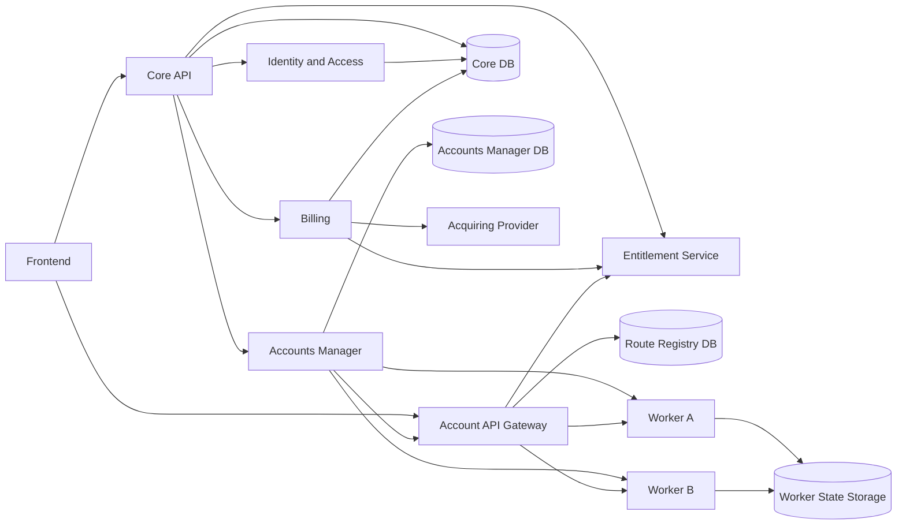
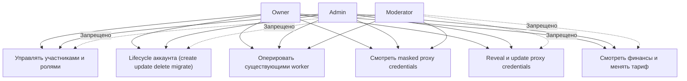
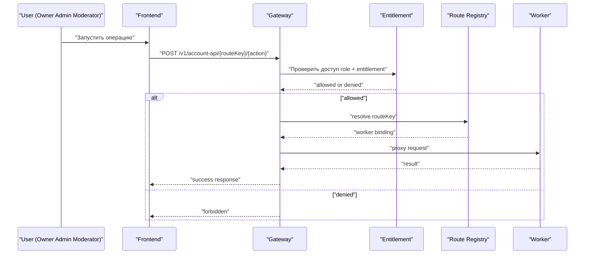
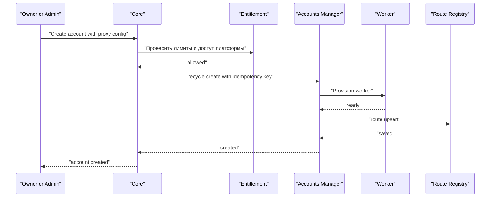
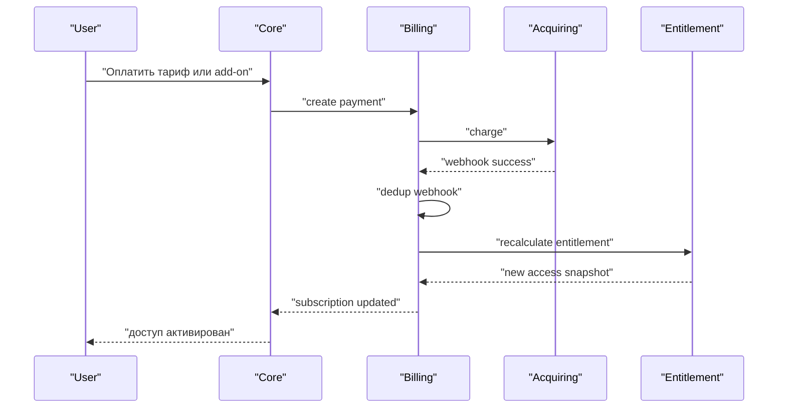
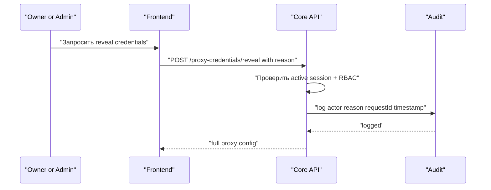
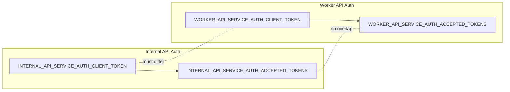

# DDCRM — Диаграммы использования и общей архитектуры

## 1) Общая архитектура

## 2) Диаграмма использования (роли -> действия)

## 3) Сценарий: Операционный вызов к worker через Gateway

## 4) Сценарий: Создание аккаунта (owner admin)

## 5) Сценарий: Оплата -> активация доступа

## 6) Сценарий: Reveal proxy credentials

## 7) Сценарий: Auth токены internal и worker (изоляция)

